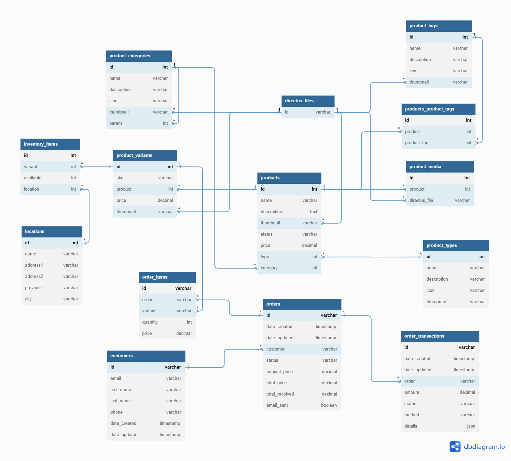

# Schema for E-commerce

## Before using
Some of the collections uses the following extensions, you can install them or change the settings after importing:
1. [directus-extension-currency-interface](https://github.com/rezo-labs/directus-extension-currency-interface): `npm i directus-extension-currency-interface`
2. [directus-extension-tags-m2m-interface](https://github.com/dimitrov-adrian/directus-extension-tags-m2m-interface): `npm i directus-extension-tags-m2m-interface`

## Import
### Import all collections at once
Make sure to delete all relevant collections before proceeding.
1. Create folder `ecommerce`.
2. Import file `all.json`.

### Import non-existing collections
Use this if you don't want to delete existing relevant collections.
1. Create folder `ecommerce` if not exists.
2. Import this non-existing collections in the following orders:
    1. `customers`
    2. `product_types`
    3. `product_categories`
    4. `product_tags`
    5. `products`
    6. `product_media`
    7. `products_product_tags`
    8. `product_variants`
    9. `locations`
    10. `inventory_items`
    11. `orders`
    12. `order_items`
    13. `order_transactions`

## Design Explain

Orders Statuses:
- **Pending**: the order is waiting for the customer to make payment.
- **Paid**: the order has been paid by the customer.
- **Cancelled**: the order has been cancelled by the customer.
- **Expired**: the order is marked as expired by the system after a certain time.

Order Transactions Statuses:
- **Pending**: the transaction is waiting for the customer to complete.
- **Success**: the transaction has been completed successfully.
- **Error**: the transaction is cancelled by the customer or an error while processing the transaction. Use `details` to store the information about the error.
